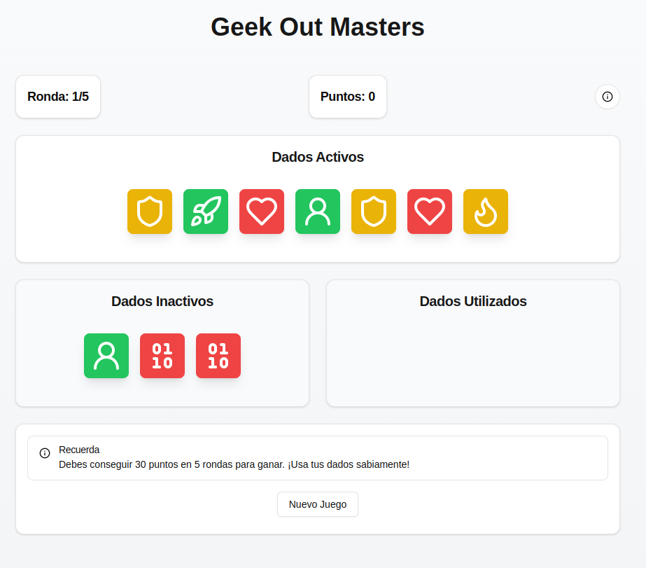

<div align="center">

# Geek Out Masters

[](https://nextjs.org/)
[](https://www.typescriptlang.org/)
[](https://tailwindcss.com/)
[](LICENSE)

Una implementación digital del juego de mesa Geek Out Masters.

[Demo en vivo](https://geek-out-masters.vercel.app) | [Reporte un bug](https://github.com/tuusuario/geek-out-masters/issues) | [Solicita una función](https://github.com/tuusuario/geek-out-masters/issues)



</div>

## ✨ Descripción

Geek Out Masters es un juego de dados estratégico donde los jugadores buscan conseguir la mítica cifra "42". Según la "Guía del viajero intergaláctico" de Douglas Adams, 42 es la respuesta al sentido de la vida, el universo y todo lo demás.

### 🎯 Objetivo
Consigue 30 puntos en 5 rondas para ganar. Los puntos se obtienen coleccionando dados con la cara "42".

### 🎲 Mecánicas Principales
- Comienza cada turno con 7 dados activos y 3 inactivos
- Debes ejecutar TODAS las acciones de los dados
- Evita quedarte con dragones o perderás tus puntos
- Decide estratégicamente cuándo continuar o pasar

## 🚀 Inicio Rápido

1. **Prerequisitos**
  ```bash
  node >= 18.17.0
  pnpm >= 8.0.0
  ```


## 🎮 Guía de Juego


### Caras de los Dados

| Cara  | Función | Descripción |
|-------|---------|-------------|
| 🎯 Meeple | Relanzar | Vuelve a lanzar otro dado activo |
| 🚀 Nave | Eliminar | Envía un dado al área inactiva |
| 🦸 Superhéroe | Voltear | Da vuelta un dado a su cara opuesta |
| ❤️ Corazón | Activar | Trae un dado inactivo al área activa |
| 🐉 Dragón | Peligro | Si queda visible, pierdes tus puntos |
| 42 | Puntos | Suma puntos según la cantidad acumulada |

### Sistema de Puntuación

| Dados 42 | 1 | 2 | 3 | 4 | 5 | 6 | 7 | 8 | 9 | 10 |
|----------|---|---|---|---|---|---|---|---|---|----| 
| Puntos | 1 | 3 | 6 | 10 | 15 | 21 | 28 | 36 | 45 | 55 |

## 🛠️ Stack Tecnológico

- **Framework:** [Next.js 14](https://nextjs.org/)
- **Lenguaje:** [TypeScript](https://www.typescriptlang.org/)
- **Estilado:** [Tailwind CSS](https://tailwindcss.com/)
- **Componentes UI:** [shadcn/ui](https://ui.shadcn.com/)
- **Iconos:** [Lucide Icons](https://lucide.dev/)

## 📁 Estructura del Proyecto

```plaintext
.
├── src
│   ├── app
│   │   ├── globals.css
│   │   ├── layout.tsx
│   │   └── page.tsx
│   ├── components
│   │   ├── game
│   │   │   ├── DiceArea.tsx
│   │   │   ├── Dice.tsx
│   │   │   ├── GameBoard.tsx
│   │   │   └── HelpCard.tsx
│   │   └── ui
│   │       ├── alert.tsx
│   │       ├── button.tsx
│   │       ├── card.tsx
│   │       ├── dialog.tsx
│   │       ├── scroll-area.tsx
│   │       └── tooltip.tsx
│   ├── hooks
│   │   └── useGameState.ts
│   ├── lib
│   │   └── utils.ts
│   └── types
│       └── game.ts
├── tailwind.config.ts
└── tsconfig.json
```

## 🤝 Contribuir

Las contribuciones son siempre bienvenidas! Por favor lee nuestras [guías de contribución](CONTRIBUTING.md) primero.

1. Fork el proyecto
2. Crea tu rama de función (`git checkout -b feature/AmazingFeature`)
3. Commit tus cambios (`git commit -m 'Add: nueva característica'`)
4. Push a la rama (`git push origin feature/AmazingFeature`)
5. Abre un Pull Request

## 🎨 Créditos

- Diseño original del juego: Matías Saravia
- Arte y diseño UI: El Dragón Azul
- Desarrollo web: [anvorja](https://github.com/anvorja)

## 📫 Contacto

Link del proyecto: [https://github.com/anvorja/geek-out-masters](https://github.com/anvorja/geek-out-masters)

---

<div align="center">
  Hecho con ❤️ por <a href="https://github.com/anvorja">anvorja</a>
</div>